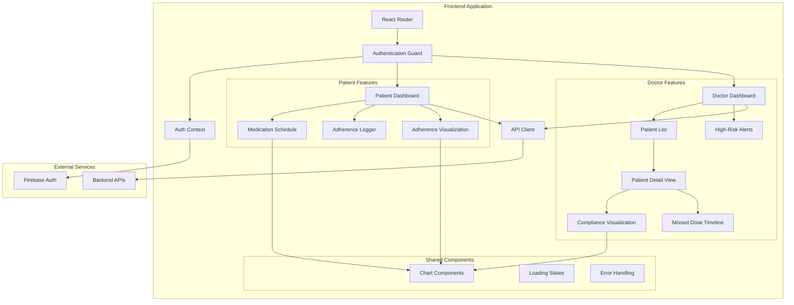

# Design Document: HealMate Phase 3 Core Frontend

## Overview

The HealMate Phase 3 Core Frontend is a React.js application that provides role-based dashboards for patients and doctors in a medication adherence tracking system. The application integrates with existing backend APIs and Firebase Authentication to deliver secure, responsive interfaces for medication schedule management, adherence logging, and compliance monitoring.

The architecture follows a component-based design with React Router for navigation, Context API for state management, and Tailwind CSS for styling. The system implements authentication guards, role-based access control, and real-time data visualization using Chart.js or Recharts.

## Architecture

### High-Level Architecture



### Technology Stack

- **Framework**: React.js 18+
- **Routing**: React Router v6
- **State Management**: React Context API + useState/useReducer
- **Authentication**: Firebase Authentication
- **Styling**: Tailwind CSS
- **Charts**: Recharts (recommended for React integration)
- **HTTP Client**: Axios or Fetch API
- **Build Tool**: Vite or Create React App

### Routing Structure

```
/
├── /login (public)
├── /register (public)
├── /patient (protected, patient role)
│   └── /dashboard
├── /doctor (protected, doctor role)
│   ├── /dashboard
│   └── /patient/:patientId
└── /unauthorized (public)
```

## Components and Interfaces

### Authentication Layer

#### AuthContext

Manages global authentication state and provides authentication methods.

```typescript
interface AuthContextType {
  user: User | null;
  role: 'patient' | 'doctor' | null;
  loading: boolean;
  login: (email: string, password: string) => Promise<void>;
  logout: () => Promise<void>;
  isAuthenticated: boolean;
}

interface User {
  uid: string;
  email: string;
  displayName: string;
  role: 'patient' | 'doctor';
}
```

**Responsibilities**:
- Initialize Firebase Authentication
- Listen to authentication state changes
- Fetch user role from backend after Firebase authentication
- Provide authentication status to child components
- Handle login/logout operations

#### ProtectedRoute Component

Guards routes based on authentication and role.

```typescript
interface ProtectedRouteProps {
  children: React.ReactNode;
  requiredRole?: 'patient' | 'doctor';
}
```

**Logic**:
1. Check if user is authenticated via AuthContext
2. If not authenticated, redirect to /login
3. If requiredRole is specified, verify user role matches
4. If role doesn't match, redirect to /unauthorized
5. If all checks pass, render children

### Patient Dashboard Components

#### MedicationSchedule Component

Displays daily medication schedule with intake status.

```typescript
interface Medication {
  id: string;
  name: string;
  dosage: string;
  scheduledTime: string; // HH:mm format
  status: 'pending' | 'taken' | 'missed';
  adherenceLogId?: string;
}

interface MedicationScheduleProps {
  date: Date;
  onLogIntake: (medicationId: string) => Promise<void>;
}
```

**Features**:
- Fetch medications for selected date from backend
- Display medications sorted by scheduled time
- Visual indicators for status (pending/taken/missed)
- Highlight current medication based on time
- Disable "Mark as Taken" for already logged medications

#### AdherenceLogger Component

Handles medication intake logging.

```typescript
interface AdherenceLogRequest {
  medicationId: string;
  patientId: string;
  scheduledTime: string;
  actualTime: string;
  status: 'taken' | 'missed';
}
```

**Logic**:
1. Validate medication hasn't been logged already
2. Create adherence log with current timestamp
3. Send POST request to backend API
4. Update local state optimistically
5. Revert on API failure with error message
6. Refresh medication schedule on success

#### AdherenceVisualization Component

Displays adherence metrics with charts.

```typescript
interface AdherenceMetrics {
  dailyPercentage: number;
  weeklyPercentage: number;
  dailyData: Array<{ date: string; percentage: number }>;
  weeklyData: Array<{ week: string; percentage: number }>;
}
```

**Chart Configuration**:
- Line chart for daily adherence trend (last 7 days)
- Bar chart for weekly adherence (last 4 weeks)
- Progress indicators for current day/week percentages
- Color coding: green (≥80%), yellow (60-79%), red (<60%)

### Doctor Dashboard Components

#### PatientList Component

Displays searchable, filterable list of patients.

```typescript
interface PatientSummary {
  id: string;
  name: string;
  complianceScore: number;
  lastActivity: string; // ISO date string
  consecutiveMissedDoses: number;
}

interface PatientListProps {
  onPatientSelect: (patientId: string) => void;
}
```

**Features**:
- Real-time search filtering by patient name
- Sort by compliance score (ascending)
- Display compliance score with color indicators
- Click to navigate to patient detail view
- Loading states during data fetch

#### PatientDetailView Component

Comprehensive view of individual patient data.

```typescript
interface PatientDetail {
  id: string;
  name: string;
  email: string;
  complianceScore: number;
  adherenceHistory: AdherenceRecord[];
  missedDoses: MissedDose[];
  medications: Medication[];
}

interface AdherenceRecord {
  date: string;
  percentage: number;
}

interface MissedDose {
  medicationName: string;
  scheduledTime: string;
  date: string;
}
```

**Sections**:
1. Patient header with name and overall compliance
2. Compliance trend chart (30-day view)
3. Missed dose timeline (last 30 days)
4. Current medication list

#### ComplianceVisualization Component

Charts for patient compliance trends.

```typescript
interface ComplianceData {
  daily: Array<{ date: string; score: number }>;
  weekly: Array<{ week: string; score: number }>;
  monthly: Array<{ month: string; score: number }>;
}
```

**Chart Types**:
- Line chart for daily compliance (30 days)
- Bar chart for weekly compliance (12 weeks)
- Area chart for monthly compliance (6 months)
- Threshold lines at 80% and 60% for visual reference

#### HighRiskAlerts Component

Dashboard widget for high-risk patients.

```typescript
interface HighRiskPatient {
  id: string;
  name: string;
  complianceScore: number;
  consecutiveMissedDoses: number;
  lastMissedDate: string;
}
```

**Logic**:
- Filter patients with compliance score < 60%
- Sort by compliance score ascending
- Display top 10 high-risk patients
- Click to navigate to patient detail
- Auto-refresh every 5 minutes

### Shared Components

#### ChartWrapper Component

Reusable wrapper for chart components with consistent styling.

```typescript
interface ChartWrapperProps {
  title: string;
  children: React.ReactNode;
  loading?: boolean;
  error?: string;
  onRetry?: () => void;
}
```

#### LoadingSpinner Component

Consistent loading indicator across the application.

#### ErrorMessage Component

Displays error messages with optional retry action.

```typescript
interface ErrorMessageProps {
  message: string;
  onRetry?: () => void;
}
```

## Data Models

### Frontend State Models

#### AuthState

```typescript
interface AuthState {
  user: User | null;
  role: 'patient' | 'doctor' | null;
  token: string | null;
  loading: boolean;
  error: string | null;
}
```

#### MedicationScheduleState

```typescript
interface MedicationScheduleState {
  medications: Medication[];
  selectedDate: Date;
  loading: boolean;
  error: string | null;
}
```

#### PatientListState

```typescript
interface PatientListState {
  patients: PatientSummary[];
  filteredPatients: PatientSummary[];
  searchQuery: string;
  loading: boolean;
  error: string | null;
}
```

### API Response Models

#### Backend API Endpoints

```typescript
// GET /api/medications/schedule?date=YYYY-MM-DD
interface MedicationScheduleResponse {
  medications: Array<{
    id: string;
    name: string;
    dosage: string;
    scheduledTime: string;
    status: 'pending' | 'taken' | 'missed';
  }>;
}

// POST /api/adherence/log
interface AdherenceLogResponse {
  success: boolean;
  adherenceLogId: string;
  message: string;
}

// GET /api/adherence/metrics?period=daily|weekly
interface AdherenceMetricsResponse {
  percentage: number;
  data: Array<{ date: string; percentage: number }>;
}

// GET /api/doctor/patients
interface PatientsResponse {
  patients: Array<{
    id: string;
    name: string;
    complianceScore: number;
    lastActivity: string;
    consecutiveMissedDoses: number;
  }>;
}

// GET /api/doctor/patient/:id
interface PatientDetailResponse {
  patient: {
    id: string;
    name: string;
    email: string;
    complianceScore: number;
  };
  adherenceHistory: Array<{ date: string; percentage: number }>;
  missedDoses: Array<{
    medicationName: string;
    scheduledTime: string;
    date: string;
  }>;
  medications: Array<{
    id: string;
    name: string;
    dosage: string;
    frequency: string;
  }>;
}

// GET /api/doctor/high-risk
interface HighRiskPatientsResponse {
  patients: Array<{
    id: string;
    name: string;
    complianceScore: number;
    consecutiveMissedDoses: number;
    lastMissedDate: string;
  }>;
}
```

### Local Storage Schema

```typescript
interface LocalStorageData {
  authToken: string;
  userRole: 'patient' | 'doctor';
  userId: string;
  cachedMedications?: {
    date: string;
    data: Medication[];
    timestamp: number;
  };
}
```

**Cache Invalidation**: Cache expires after 5 minutes or on manual refresh.


## Correctness Properties

A property is a characteristic or behavior that should hold true across all valid executions of a system—essentially, a formal statement about what the system should do. Properties serve as the bridge between human-readable specifications and machine-verifiable correctness guarantees.

### Authentication and Authorization Properties

Property 1: Unauthenticated redirect
*For any* protected route, when accessed by an unauthenticated user, the system should redirect to the login page
**Validates: Requirements 1.1**

Property 2: Authentication token storage
*For any* successful Firebase authentication, the system should store the authentication token and grant access to protected routes
**Validates: Requirements 1.2**

Property 3: Role-based route access control
*For any* user with a specific role (patient or doctor), attempting to access routes restricted to the opposite role should result in denial and redirect to their appropriate dashboard
**Validates: Requirements 2.1, 2.2**

Property 4: Role retrieval and storage
*For any* authenticated user, the system should fetch their role from the backend and store it in application state
**Validates: Requirements 2.3**

Property 5: Role-based navigation rendering
*For any* authenticated user, the rendered navigation elements should match their role permissions
**Validates: Requirements 2.4**

### Medication Schedule Properties

Property 6: Complete medication display
*For any* patient viewing their dashboard on a given date, all medications scheduled for that date should be displayed with their scheduled times
**Validates: Requirements 3.1**

Property 7: Medication information completeness
*For any* displayed medication, the rendered output should contain medication name, dosage, scheduled time, and intake status
**Validates: Requirements 3.2**

Property 8: Past medication status indication
*For any* medication whose scheduled time has passed, the system should display a visual indicator showing whether it was taken or missed
**Validates: Requirements 3.3**

Property 9: Current medication highlighting
*For any* medication whose scheduled time matches the current time, the system should apply highlighting to that medication
**Validates: Requirements 3.4**

Property 10: Medication time ordering
*For any* list of medications, they should be sorted by scheduled time in ascending order
**Validates: Requirements 3.5**

### Adherence Logging Properties

Property 11: Medication logging creates record
*For any* medication marked as taken, the system should create an adherence log with timestamp and update the UI to reflect the taken status
**Validates: Requirements 4.1, 4.4**

Property 12: Adherence API integration
*For any* medication marked as taken, the system should send the adherence data to the backend API
**Validates: Requirements 4.2**

Property 13: API failure error handling
*For any* failed API request during medication logging, the system should display an error message and revert the UI state to its previous condition
**Validates: Requirements 4.3**

Property 14: Duplicate logging prevention
*For any* medication at a specific scheduled time, the system should prevent logging it as taken more than once
**Validates: Requirements 4.5**

### Adherence Calculation Properties

Property 15: Adherence percentage calculation
*For any* set of scheduled medications and taken medications, the adherence percentage should equal (taken count / scheduled count) × 100
**Validates: Requirements 5.3**

### Patient List and Search Properties

Property 16: Real-time search filtering
*For any* search query entered in the patient list, the displayed patients should be filtered to only those whose names contain the query string
**Validates: Requirements 6.2**

Property 17: Patient information completeness
*For any* displayed patient in the list, the rendered output should contain patient name, compliance score, and last activity date
**Validates: Requirements 6.3**

Property 18: Patient compliance score sorting
*For any* list of patients, they should be sorted by compliance score in ascending order (lowest first)
**Validates: Requirements 6.4**

Property 19: Patient selection navigation
*For any* patient clicked in the list, the system should navigate to that patient's detail view with the correct patient ID
**Validates: Requirements 6.5**

### Compliance Visualization Properties

Property 20: Compliance score color indicators
*For any* compliance score below 80%, the system should display it with a warning color indicator; for any score below 60%, the system should display it with a critical color indicator
**Validates: Requirements 7.4, 7.5**

### Missed Dose Properties

Property 21: Missed dose information completeness
*For any* displayed missed dose, the rendered output should contain medication name, scheduled time, and date
**Validates: Requirements 8.2**

Property 22: Missed dose chronological sorting
*For any* list of missed doses, they should be sorted by date and time in descending order (most recent first)
**Validates: Requirements 8.3**

Property 23: Missed dose date filtering
*For any* missed dose timeline, only doses from the most recent 30 days should be included
**Validates: Requirements 8.5**

### High-Risk Alert Properties

Property 24: High-risk patient identification
*For any* patient with a compliance score below 60%, they should be included in the high-risk patient alerts
**Validates: Requirements 9.2**

Property 25: High-risk alert information completeness
*For any* displayed high-risk alert, the rendered output should contain patient name, compliance score, and number of consecutive missed doses
**Validates: Requirements 9.3**

Property 26: High-risk patient sorting
*For any* list of high-risk patients, they should be sorted by compliance score in ascending order
**Validates: Requirements 9.4**

Property 27: High-risk alert navigation
*For any* high-risk alert clicked, the system should navigate to that patient's detail view
**Validates: Requirements 9.5**

### Responsive Design Properties

Property 28: Mobile layout activation
*For any* viewport width below 768px, the system should display a mobile-optimized layout
**Validates: Requirements 10.1**

Property 29: Desktop layout activation
*For any* viewport width at or above 768px, the system should display a desktop-optimized layout
**Validates: Requirements 10.2**

Property 30: Mobile collapsible navigation
*For any* navigation elements displayed on mobile viewport, the system should use a collapsible menu
**Validates: Requirements 10.4**

Property 31: Touch-friendly element sizing
*For any* interactive element on mobile viewport, the element should have minimum dimensions of 44x44 pixels
**Validates: Requirements 10.5**

### Data Loading and Error Handling Properties

Property 32: Loading indicator display
*For any* API data fetch operation, the system should display a loading indicator during the fetch
**Validates: Requirements 11.1**

Property 33: API error handling with retry
*For any* failed API request, the system should display an error message with a retry option
**Validates: Requirements 11.2**

Property 34: Loading state cleanup
*For any* successfully completed data load, the system should remove loading indicators and display the fetched data
**Validates: Requirements 11.3**

Property 35: Data caching behavior
*For any* data fetched from the backend, the system should cache it to avoid redundant API calls for the same data
**Validates: Requirements 11.4**

Property 36: Cache invalidation and refresh
*For any* cached data that becomes stale (exceeds cache timeout), the system should refresh it from the backend
**Validates: Requirements 11.5**

### Chart Responsiveness Properties

Property 37: Chart container responsiveness
*For any* chart component, the chart should adapt its width to match its container width
**Validates: Requirements 12.4**

## Error Handling

### Authentication Errors

**Firebase Authentication Failures**:
- Display user-friendly error messages for common Firebase errors
- Invalid credentials: "Invalid email or password"
- Network errors: "Unable to connect. Please check your internet connection"
- Account disabled: "This account has been disabled. Please contact support"

**Token Expiration**:
- Detect expired tokens on API requests (401 responses)
- Clear authentication state
- Redirect to login with message: "Your session has expired. Please log in again"

**Role Fetch Failures**:
- If role cannot be fetched after authentication, log out user
- Display error: "Unable to retrieve account information. Please try again"

### API Request Errors

**Network Errors**:
- Catch network failures (no response from server)
- Display: "Unable to connect to server. Please check your connection"
- Provide retry button

**Server Errors (5xx)**:
- Display: "Server error occurred. Please try again later"
- Log error details for debugging
- Provide retry button

**Client Errors (4xx)**:
- 400 Bad Request: "Invalid request. Please check your input"
- 404 Not Found: "Requested resource not found"
- 403 Forbidden: "You don't have permission to access this resource"

**Timeout Errors**:
- Set 30-second timeout for all API requests
- Display: "Request timed out. Please try again"
- Provide retry button

### Data Validation Errors

**Empty Required Fields**:
- Validate all form inputs before submission
- Display inline error messages for empty required fields
- Prevent form submission until validation passes

**Invalid Date Ranges**:
- Validate date selections for adherence history
- Ensure start date is before end date
- Display: "Invalid date range selected"

### UI Error Boundaries

**Component Error Boundaries**:
- Wrap major sections in React Error Boundaries
- Display fallback UI: "Something went wrong. Please refresh the page"
- Log error details to console for debugging
- Provide "Refresh" button to reload component

**Chart Rendering Errors**:
- Catch chart rendering failures
- Display: "Unable to display chart. Data may be invalid"
- Show raw data in table format as fallback

### Offline Handling

**Network Connectivity**:
- Detect offline status using navigator.onLine
- Display banner: "You are offline. Some features may not work"
- Queue adherence logs locally when offline
- Sync queued logs when connection restored

## Testing Strategy

### Dual Testing Approach

The testing strategy employs both unit tests and property-based tests to ensure comprehensive coverage:

- **Unit tests**: Verify specific examples, edge cases, error conditions, and integration points between components
- **Property-based tests**: Verify universal properties across all inputs through randomized testing

Both approaches are complementary and necessary. Unit tests catch concrete bugs in specific scenarios, while property-based tests verify general correctness across a wide range of inputs.

### Property-Based Testing Configuration

**Library Selection**: Use **fast-check** for property-based testing in JavaScript/TypeScript

**Test Configuration**:
- Minimum 100 iterations per property test (due to randomization)
- Each property test must reference its design document property
- Tag format: `// Feature: healmate-phase3-core-frontend, Property {number}: {property_text}`

**Property Test Implementation**:
- Each correctness property listed in this document must be implemented as a single property-based test
- Tests should generate random valid inputs to verify properties hold universally
- Use appropriate generators for domain objects (users, medications, dates, etc.)

### Unit Testing Strategy

**Component Testing**:
- Test individual React components in isolation using React Testing Library
- Focus on user interactions and rendered output
- Mock API calls and external dependencies

**Integration Testing**:
- Test component interactions and data flow
- Test routing and navigation between pages
- Test authentication flow with mocked Firebase

**Edge Cases and Error Conditions**:
- Empty data states (no medications, no patients)
- Boundary values (compliance scores at 0%, 60%, 80%, 100%)
- API failure scenarios
- Network timeout scenarios
- Invalid user inputs

**Example-Based Tests**:
- Specific scenarios from requirements marked as "example" in prework
- User logout flow (Requirement 1.4)
- Initial app load authentication check (Requirement 1.5)
- Dashboard data display (Requirements 5.1, 5.2, 6.1, 7.1, 7.3, 8.1, 8.4, 9.1)
- Empty state messages (Requirement 8.4, 12.5)

### Test Coverage Goals

- **Component Coverage**: 80%+ line coverage for all components
- **Property Coverage**: 100% of correctness properties implemented as tests
- **Critical Path Coverage**: 100% coverage of authentication and authorization flows
- **Error Handling Coverage**: All error scenarios tested

### Testing Tools

- **Unit Testing**: Jest + React Testing Library
- **Property-Based Testing**: fast-check
- **E2E Testing** (optional): Cypress or Playwright for critical user flows
- **API Mocking**: MSW (Mock Service Worker)
- **Firebase Mocking**: Firebase Testing SDK

### Continuous Integration

- Run all tests on every pull request
- Require all tests to pass before merging
- Generate coverage reports
- Fail build if coverage drops below thresholds
