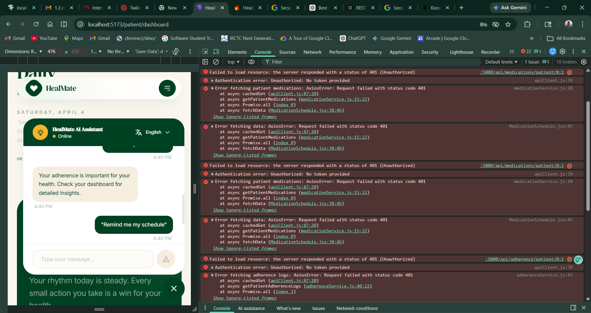

# Quick Chatbot Test - 5 Minute Verification

## Step-by-Step Testing Instructions

### 1️⃣ Start the Application (30 seconds)

```bash
cd frontend
npm run dev
```

Wait for the server to start. You should see:
```
VITE v5.x.x  ready in xxx ms
➜  Local:   http://localhost:5173/
```

Open `http://localhost:5173` in your browser.

---

### 2️⃣ Visual Check (30 seconds)

**Look for:**
- ✅ Floating chat button in bottom-right corner (blue/green circle with chat icon)
- ✅ Button is visible and not hidden behind anything
- ✅ Button has a subtle shadow/hover effect

**Action:** Hover over the button - it should have a hover effect.

---

### 3️⃣ Open Chat Window (30 seconds)

**Action:** Click the floating chat button

**Expected:**
- ✅ Chat window slides up from bottom
- ✅ Window shows header: "HealMate AI Assistant"
- ✅ Status shows "Online" (green dot)
- ✅ Language button visible: "🌐 English ▼"
- ✅ Input field at bottom with placeholder
- ✅ Send button visible
- ✅ Suggested question buttons visible

**Check:** Window should NOT overlap with navigation header at top.

---

### 4️⃣ Test Message Sending (1 minute)

**Test 1: Type and Send**
1. Type: `Hello`
2. Press Enter or click Send button
3. **Expected:** 
   - Your message appears on right (blue bubble)
   - Bot responds on left (gray bubble) within 1 second
   - Both messages have timestamps

**Test 2: Keyword Response**
1. Type: `missed dose`
2. Send
3. **Expected:** Bot gives specific advice about missed doses

**Test 3: Another Keyword**
1. Type: `medicine`
2. Send
3. **Expected:** Bot gives medication schedule advice

---

### 5️⃣ Test Suggested Questions (30 seconds)

**Action:** Click each suggested question button:
- "Did I miss my medicine?"
- "What is my adherence?"
- "Remind me my schedule"

**Expected:**
- ✅ Each click sends the question
- ✅ Bot responds to each question
- ✅ Chat scrolls to show new messages

---

### 6️⃣ Test Language Selector (1 minute)

**Action 1:** Click the language button "🌐 English ▼" in chat header

**Expected:**
- ✅ Dropdown menu opens
- ✅ Shows 7 languages:
  - English ✓
  - हिंदी (Hindi)
  - தமிழ் (Tamil)
  - తెలుగు (Telugu)
  - বাংলা (Bengali)
  - मराठी (Marathi)
  - ગુજરાતી (Gujarati)
- ✅ Current language has checkmark

**Action 2:** Click "हिंदी (Hindi)"

**Expected:**
- ✅ Dropdown closes
- ✅ Header changes to "HealMate AI सहायक"
- ✅ Status shows "ऑनलाइन"
- ✅ Input placeholder changes to Hindi
- ✅ Suggested questions change to Hindi
- ✅ Language button shows "🌐 हिंदी ▼"

**Action 3:** Switch back to English

---

### 7️⃣ Test Close/Reopen (30 seconds)

**Action 1:** Click the X button in chat header

**Expected:**
- ✅ Chat window closes smoothly
- ✅ Floating button remains visible

**Action 2:** Click floating button again

**Expected:**
- ✅ Chat reopens
- ✅ Previous messages are still visible
- ✅ Conversation history preserved

---

### 8️⃣ Test on Mobile View (1 minute)

**Action:**
1. Press F12 to open DevTools
2. Press Ctrl+Shift+M (or Cmd+Shift+M on Mac) for device toolbar
3. Select "iPhone SE" or "iPhone 12 Pro"

**Expected:**
- ✅ Chat button still visible
- ✅ Chat window fits screen properly
- ✅ All buttons are touch-friendly (not too small)
- ✅ Text is readable
- ✅ Can send messages on mobile view

---

### 9️⃣ Check Browser Console (30 seconds)

**Action:**
1. Keep DevTools open (F12)
2. Go to Console tab
3. Look for any red error messages

**Expected:**
- ✅ No red error messages
- ✅ No warnings about missing files
- ✅ No CORS errors

---

### 🔟 Run Automated Tests (30 seconds)

**Action:**
```bash
npm test
```

**Expected:**
```
Test Suites: X passed, X total
Tests:       24 passed, 24 total
```

All tests should pass ✅

---

## ✅ SUCCESS CRITERIA

Your chatbot is working properly if:

1. ✅ Chat button visible and clickable
2. ✅ Chat window opens/closes smoothly
3. ✅ Messages can be sent and received
4. ✅ Bot responds with relevant messages
5. ✅ Language selector works (all 7 languages)
6. ✅ Suggested questions work
7. ✅ Responsive on mobile view
8. ✅ No console errors
9. ✅ All automated tests pass

---

## 🚀 BONUS: Test AI Mode (Optional)

If you have OpenAI API key configured:

**Action:**
1. Check `frontend/.env` has `VITE_OPENAI_API_KEY=sk-...`
2. Restart dev server
3. Send: "What should I do if I missed my medication?"

**Expected:**
- ✅ Bot shows "typing..." indicator
- ✅ Bot responds with intelligent, contextual answer
- ✅ Response is healthcare-focused
- ✅ Follow-up questions maintain context

---

## 🐛 If Something Doesn't Work

### Chat button not visible?
```bash
# Clear cache and reload
Ctrl+Shift+R (or Cmd+Shift+R on Mac)
```

### Messages not sending?
1. Check browser console for errors
2. Verify `chatService.js` exists in `src/services/`
3. Restart dev server

### Language selector not working?
1. Check that dropdown has high z-index
2. Verify `translations.js` exists
3. Clear browser cache

### Tests failing?
```bash
# Reinstall dependencies
npm install
npm test
```

---

## 📊 Test Results Template

Copy this and fill it out:

```
CHATBOT TEST RESULTS
Date: ___________
Tester: ___________

[ ] Chat button visible
[ ] Chat opens/closes
[ ] Messages send/receive
[ ] Bot responds correctly
[ ] Language selector works
[ ] All 7 languages tested
[ ] Suggested questions work
[ ] Mobile responsive
[ ] No console errors
[ ] All tests pass (24/24)

OVERALL STATUS: ✅ PASS / ❌ FAIL

Notes:
_________________________________
_________________________________
```

---

## 🎥 Demo Recording Checklist

When recording for hackathon/demo:

1. [ ] Show app homepage
2. [ ] Point out chat button
3. [ ] Open chat window
4. [ ] Send a message
5. [ ] Show bot response
6. [ ] Click language button
7. [ ] Switch to Hindi
8. [ ] Show UI translation
9. [ ] Send message in Hindi
10. [ ] Show suggested questions
11. [ ] Switch to mobile view
12. [ ] Show it works on mobile
13. [ ] Highlight smooth animations

**Duration:** 2-3 minutes max

---

**Ready to test?** Start with Step 1 and work through each step! 🚀
